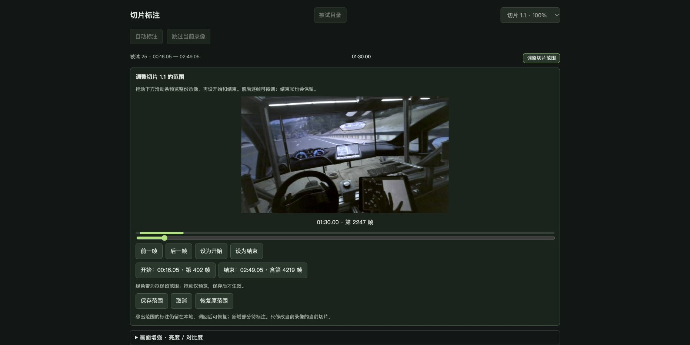

[项目展示](https://capybarra1.github.io/eye-tracking-aoi/) · [GitHub 主页](https://github.com/capybarra1)

# 眼动 AOI 切片标注工具

> 支持动态区域跟踪、人工关键帧修复、切片调整和标注导出。

## 项目概览

头戴式眼动视频中的屏幕和平板会随视角移动，反光、遮挡、模糊和旋转增加了逐帧标注的工作量。我围绕实际研究任务开发本地 AOI 标注工具，将切片处理、区域跟踪、异常复核和数据导出放到同一工作流程中。

## 我的职责

我定义切片、区域、关键帧、复核与导出流程，使用 AI 编程工具辅助实现，并根据实际标注中的失跟、旋转、缓存和切片边界问题持续迭代。最近版本加入直线分区、首尾关键帧修复、被试目录与进度、切片范围调整、存档和数据表导出。

- 将标注任务拆为切片，保留当前进度、区域状态和异常段，支持中断后继续处理。
- 设计人工首尾关键帧修复与保存前预览，缩小需要重新标注的范围。
- 支持切片起止调整、版本备份与范围导出，保持修改记录可核对。
- 管理跨录像处理与缓存上限，减少预处理对本地资源的占用。

## 标注与复核流程

切片时间与起始区域 → 本地跟踪 → 异常标记 → 人工关键帧修复 → 范围保存与版本备份 → 导出核对。

## 关键设计与迭代

**区分处理进度和确认状态。** 时间轴保留异常段、未确认起点和缺失切片，复核人员可以定位需要介入的位置，避免计算结束后直接使用错误区域。

**局部修复保留既有工作。** 首尾关键帧先生成草稿和预览，保存前备份；修复范围外的标注和人工关键帧保留，减少重复操作。

**切片范围可调整。** 标注中发现边界不合适时，可预览整段录像并修改起止。移出范围的记录保留在本地，当前导出按新范围计算。

**区域简化与统计口径同步。** 直线分区适用于快速区分屏幕和下方近似区域。下方可能包含桌面与手，使用这类标注时需按对应 AOI 定义解释指标。

## 项目交付与验证

交付本地标注程序、合成视频演示、标注存档与数据表导出入口。63 项选定检查通过，覆盖暂停恢复、逐帧预览、直线几何、切片时间、人工关键帧和缓存；合成场景下完成切片跟踪、保存与范围编辑检查。

## 演示与运行

展示图片取自真实眼动研究录像约 01:30 的一帧，使用已有标注存档在工具中展示屏幕边界、平板区域与切片调整。仓库提供独立的合成视频启动演示；完整原始录像、参与者资料、眼动数据与研究标注存档不包含在公开包中。

CPU/OpenCV 核心流程可本地运行，可选学习模型与预处理默认关闭。真实视频精度、学习模型恢复和跨录像批量效果需在对应研究条件下评估。

[启动说明](docs/quickstart.md) · [验证记录](VERIFICATION.md)
