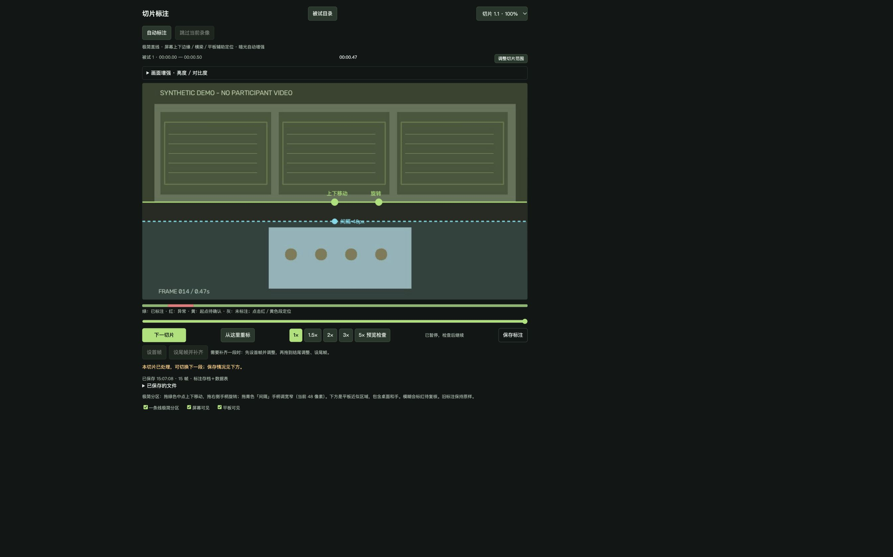
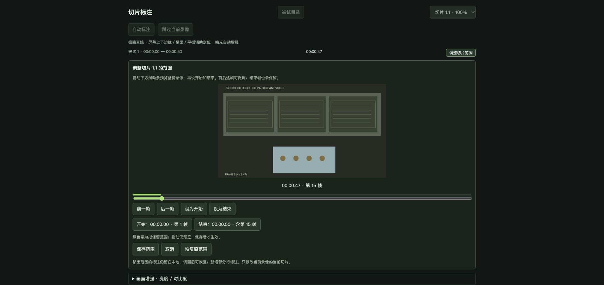
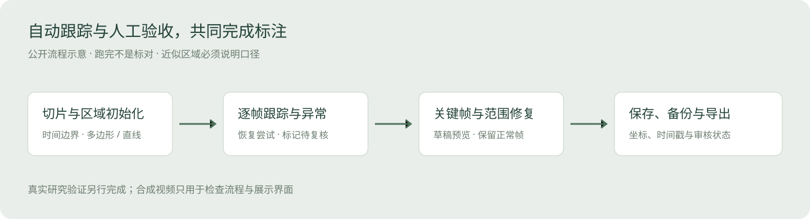

[在线项目介绍](https://capybarra1.github.io/eye-tracking-aoi/) · [GitHub 主页](https://github.com/capybarra1)

# 眼动 AOI 切片标注工具

> 最近的研究工具实践｜本地计算与人工监督｜公开演示使用合成视频

## 问题：动态 AOI 需要跟踪，也需要可信的复核

头戴式眼动视频中的屏幕和平板会随视角移动，反光、遮挡、模糊和旋转让逐帧区域标注耗时。单纯自动追踪容易把“已经跑完”误解为“标注正确”，后续眼动统计就会建立在错误区域上。

## 我的工作

围绕实际研究任务定义切片、区域、关键帧、复核与导出流程，使用 AI 开发工具辅助实现，并根据标注中遇到的失跟、旋转、缓存和切片边界问题迭代。最近版本支持直线分区、人工首尾关键帧修复、被试目录与切片进度、范围调整、存档和数据表导出。

## 公开演示

截图是原标注程序公开副本运行后的真实界面。背景视频由程序生成，只包含屏幕和平板示意，没有真实参与者、眼动、生理信号或研究录像。

切片时间与起始区域 → 本地跟踪 → 异常标记 → 人工关键帧修复 → 范围保存与版本备份 → 导出并核对。

## 三个关键判断

1. **计算完成不等于复核完成。** 保留红色问题段、未确认起点与缺失切片；模糊帧不会冒充人工确认。
2. **简化区域时同步改变解释口径。** 直线模式把上方作为屏幕、下方作为平板近似区域。下方可能包含桌面与手，不能与精细平板 AOI 指标混用。
3. **修复只改需要改的范围。** 首尾关键帧先生成草稿与预览，保存前备份；保留范围外标注和人工关键帧。切片调整保留原记录，范围外不参加当前导出。

## 效率与可靠性如何一起考虑

滚动预处理只准备当前与下一录像，设置缓存上限；未命中缓存仍能工作。失跟尝试恢复，恢复不了则交给人。工具支持本地处理，不要求 Agent 或模型服务持续在线。

公开包默认关闭可选学习模型与预处理，不包含模型权重、原始配置或数据目录。演示覆盖直线模式的区域、时间轴、暂停和导出；学习模型恢复、跨录像批量与真实暗光条件效果需另行验证。

## 验证与结果边界

本次针对暂停恢复、预览逐帧处理、直线几何、切片时间、人工关键帧和缓存运行选定检查；详细结果见仓库验证记录。界面和合成视频检查不能证明真实视频的标注精度，不公布未经统一复测的准确率或提速倍数。

## 面试可讲的能力

把眼动研究中的重复劳动转成工具；围绕异常设计人工介入；理解数据口径与算法边界；通过实际使用持续改进。

[代码与启动](docs/quickstart.md) · [GitHub 主页](https://github.com/capybarra1)
